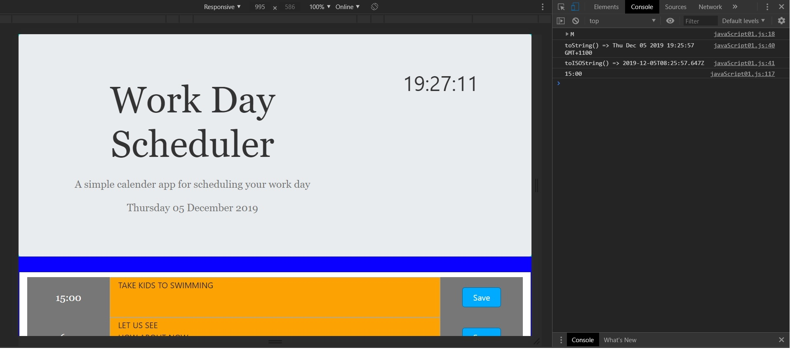
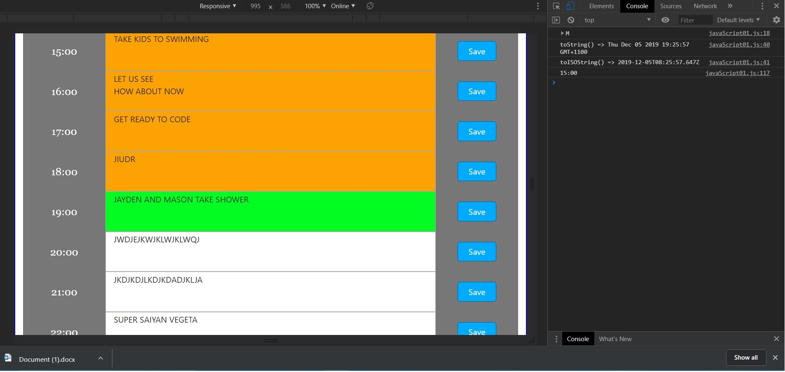
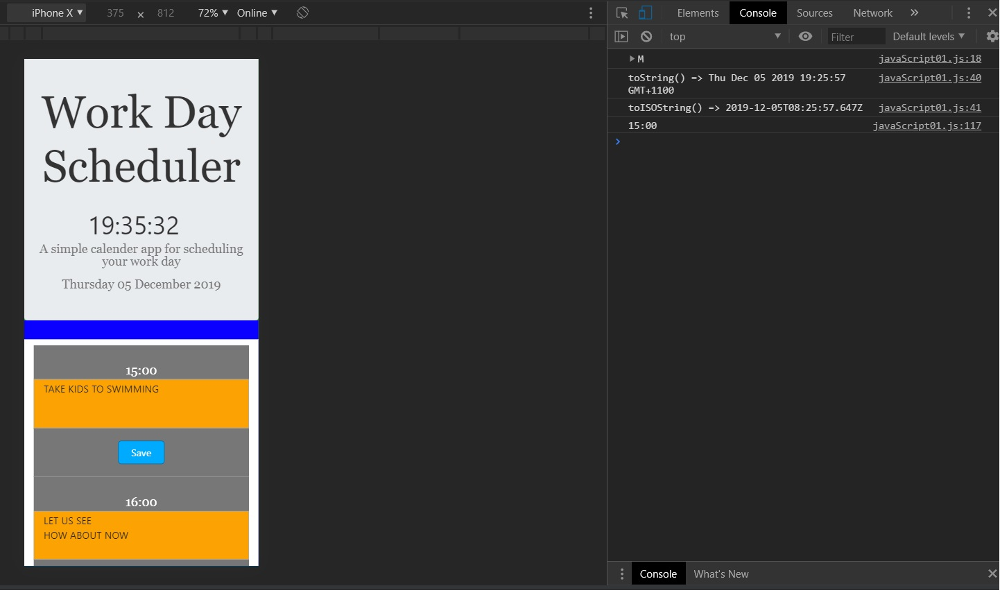

# dayCalender

Summary

The web application is a day calender that enables the user to set tasks during the course of a working day
between 09:00 and 5:00. The user enters text in the designated time block and clicks the save button which
sends the value into local storage. The user can edit the text input at any time but must click the save
button if they want to keep the entry stored. As time passes each time block is rendered a different color
depending on its state.
- If the time block is in the past the element is rendered orange.
- If the time block is currently the element is rendered green.
- If the time block is in the future the element is rendered white.
When the application rolls over to the next day, the data entries are deleted and the local storage
cleared for the upcoming working day.

The application uses 'addEventListener' so that when one of the buttons is clicked on, it will initiate
the associated function. The use of 'preventDefault' and 'stopPropagation' methods are used to prevent
the window from going to it's default settings when the function is run and prevents the clicked event
from affecting the parent elements in the application. Even though the application illustrates no noticable
bugs, there are a few things that were not rectified due to time restrictions. With additional time to work
on the code, this issue could be fixed. 

The purpose of this application is to demonstrate the use of functions and 'addEventListener' so that events
are able to be delegated to different elements in an html file. This application demonstrates how javaScript
can be utilised to create and append elements to the HTML document. This allows manipulation of element
attributes during certain times when the application is being used. In addition, implementing responsive
behaviour of html files using media queries. This enables the developer to create applications that can be
viewed on multiple devices and screen sizes such as:
- iphone
- Tablet
- Laptop
- Desktop

The following methods, objects and API's (Application programming Interface) were used in this web
application to demonstrate how javaScript can be used to apply calculations and functions to elements
in an html file:
- Arrays 
- Functions
- IF Statements
- addEventListener
- preventDefault method
- stopPropagation method
- Local Storage
- Create Elements
- Set Attributes
- AppendChild
- Moment.js
- Interval

Getting Started

This documentation will assist you in viewing this project. To view the project either open
the url of the deployed application with the following address in any browser:

https://pozengineer.github.io/dayCalender/

Download and clone the repository from GitHub using the following command:

git clone https://github.com/pozengineer/dayCalender.git

The following files are used to create the application:
- index.html
- reset.css
- style01.css
- javaScript02.js
There are additional files that should be disregarded. They were used as the initial building
blocks for the application but want to keep them for future reference.

This application was built using:
-   HTML: HyperText Markup Language that allows the developer to structure webpages
-   CSS: Style Sheet Language that allows the developer to style an HTML document
-   JavaScript: Programming Language that allows the developer to apply functions and methods to an HTML document 
-   BootStrap: Library of HTML and CSS files and code https://getbootstrap.com/
-   jQuery: JavaScript library that enables HTML document traversal and manipulation, event handling, animation,
    and Ajax much simpler with an easy-to-use API

